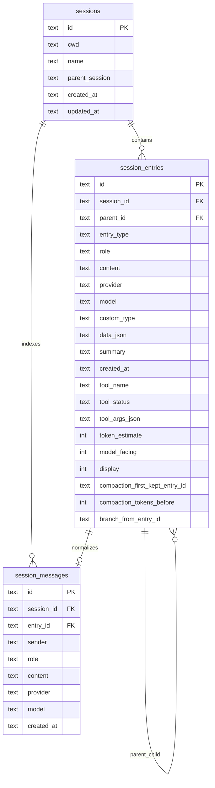
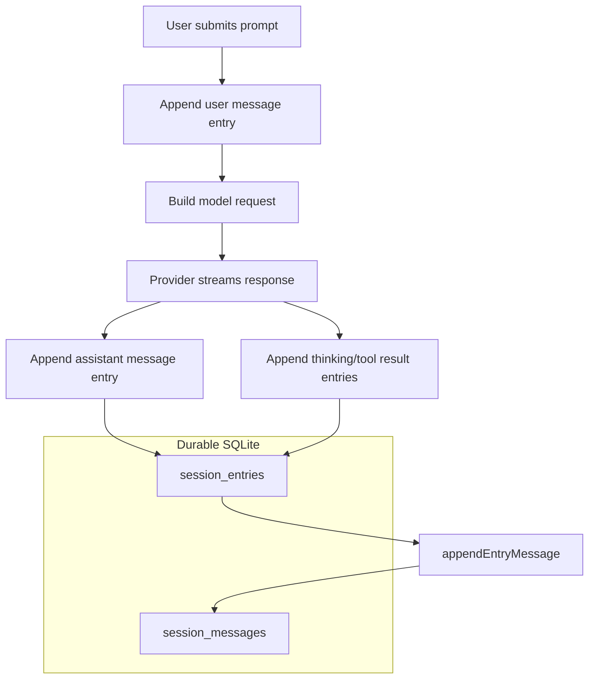
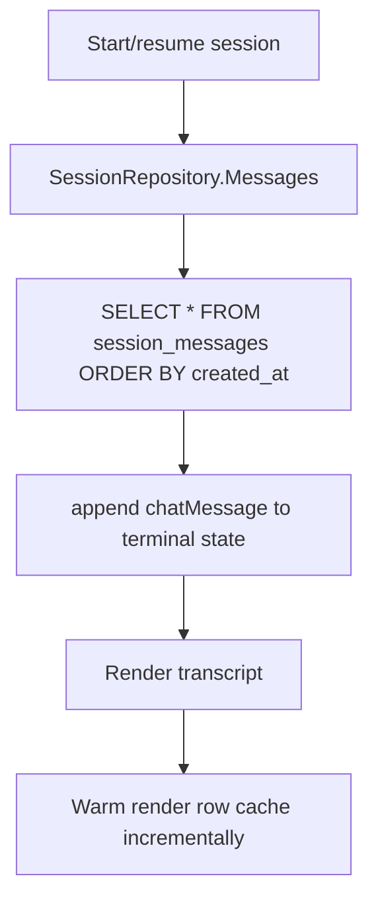
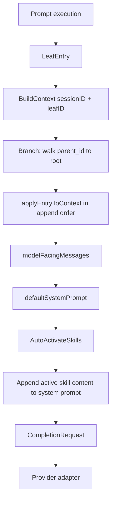
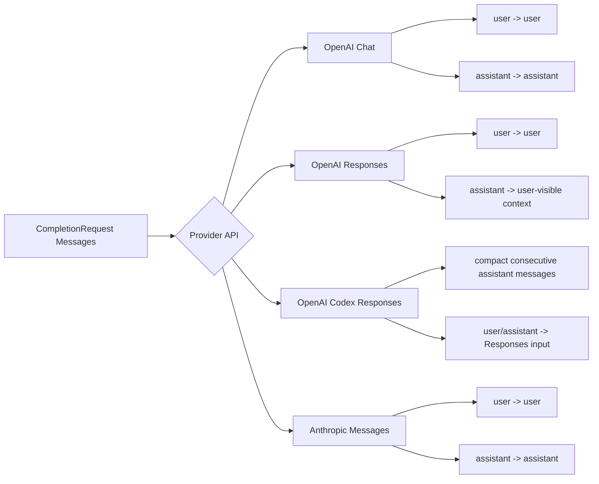
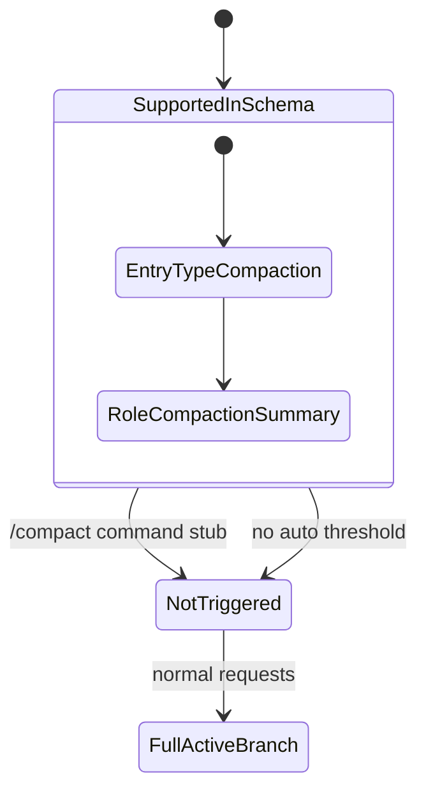
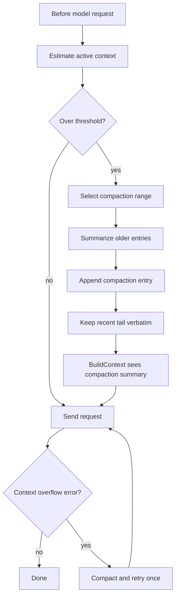

# Session Context and Compaction

This document describes how librecode session history is stored, replayed, rendered, and sent to model providers today. It also explains why a SQLite database can contain many millions of persisted tokens while the assistant sees a much smaller active context.

## Current summary

- librecode persists every session entry in SQLite under `~/.librecode/librecode.db` by default.
- The database stores both a tree of entries (`session_entries`) and a flat message index (`session_messages`).
- The terminal transcript reloads from `session_messages`, so it can show the whole durable transcript.
- Model requests are built from the active leaf branch in `session_entries`, then filtered to model-facing roles.
- Tool results and thinking are stored for UI/history, but they are not sent to the model in the current request path.
- Compaction data structures exist, but no automatic or manual compaction is implemented yet.

## Why the DB can be huge while context is not

The DB is an audit/history store. It can contain large tool outputs, thinking traces, repeated `/skill` listings, and old transcript entries.

The model request path is narrower:

1. Find the latest session leaf.
2. Walk parent pointers back to the root to build the active branch.
3. Apply branch entries into a `SessionContextEntity`.
4. Filter to model-facing roles.
5. Add the current system prompt and auto-activated skill content.
6. Send the resulting messages to the provider-specific adapter.

Today the model-facing filter includes only:

- `user`
- `assistant`

It excludes:

- `toolResult`
- `thinking`
- `custom`
- `bashExecution`
- `branchSummary`
- `compactionSummary`

That means a session DB with tens of millions of characters can still produce a much smaller request context.

## Storage model



### `session_entries`

`session_entries` is the source of truth for the session tree. Every entry has:

- an `id`
- a `session_id`
- an optional `parent_id`
- an `entry_type`
- optional message-like fields: `role`, `content`, `provider`, `model`
- optional metadata in `data_json`
- optional summary text in `summary`

Current entry types include:

- `message`
- `custom`
- `custom_message`
- `compaction`
- `branch_summary`
- `label`
- `model_change`
- `session_info`
- `thinking_level_change`

Session entries also carry typed metadata columns so context accounting and future compaction do not need to parse every entry body:

- `tool_name`, `tool_status`, `tool_args_json` for tool result entries.
- `token_estimate` for cheap context and storage-size accounting.
- `model_facing` to indicate whether an entry participates in model context reconstruction.
- `display` to indicate whether the entry should normally render in the transcript.
- `compaction_first_kept_entry_id` and `compaction_tokens_before` for future compaction coverage.
- `branch_from_entry_id` for branch summary provenance.

The migration that introduced these columns backfills existing rows using conservative heuristics from `entry_type`, `role`, `content`, `summary`, and `data_json`. New writes compute the same metadata before insertion.

### `session_messages`

`session_messages` is a normalized flat index of entries with a non-empty role. It exists to efficiently reload the UI transcript and support message-centric queries.

It mirrors message content from `session_entries`, but it does not define the active branch by itself.

## Write path today



For any entry whose `Message.Role` is non-empty, `appendEntry` also writes a matching row to `session_messages` in the same transaction.

## UI reload path

The terminal uses the flat message index for transcript replay.



Important detail: this path is for display/history, not for model context.

## Model context path



`BuildContext` reconstructs a `SessionContextEntity` from the active branch. It applies entries in order and mutates context state:

- `message` appends the message.
- `custom_message` appends custom context.
- `branch_summary` appends branch summary context.
- `compaction` replaces all previous context messages with one compaction summary.
- `model_change` changes provider/model metadata.
- `thinking_level_change` changes thinking metadata.
- labels/session info/custom state do not affect prompt context.

After that, `modelFacingMessages` filters the messages. Today, only user and assistant messages survive the filter.

## Provider-specific message mapping



Provider adapters apply their own additional mapping rules. For example, OpenAI Responses currently replays assistant text as user-visible context because `store=false` means provider-side response item IDs are not available for continuation.

## Current compaction behavior



The schema and repository can store compaction summaries:

- `EntryTypeCompaction`
- `RoleCompactionSummary`
- `AppendCompaction`
- `BuildContext` handling that resets prior messages to the compaction summary

But there is currently no real compaction execution path:

- `/compact` is not implemented.
- no auto-compaction threshold exists.
- context-limit errors are not recovered through compaction.

## Current DB observations

Local inspection of `~/.librecode/librecode.db` showed:

- 33 sessions.
- 18,490 total persisted messages.
- about 71.9M persisted message characters.
- 0 compaction entries.
- most persisted data is `toolResult` content.

For the latest long-running session:

- total persisted session content is dominated by `toolResult` and `thinking` roles.
- active branch includes 14,179 entries.
- active model-facing messages are 596 user messages and 544 assistant messages.
- active model-facing content is about 506k characters, roughly 126k tokens by the current chars/4 estimate.

That explains why a raw DB estimate produced values like ~13M tokens, while a model-facing estimate produced ~132k tokens.

## Problems with the current behavior

1. **No intentional long-term memory compression**
   - Old context can disappear implicitly due to provider/window limits instead of being summarized.

2. **No user-facing compaction command**
   - `/compact` exists as a command placeholder but does not summarize or alter context.

3. **Tool outcomes are not model-facing**
   - Tool result blocks are stored and rendered, but future model calls do not receive their raw content.
   - This reduces context size, but it can also make the assistant forget exact tool evidence unless the assistant response summarized it.

4. **Large assistant messages remain model-facing**
   - Repeated long assistant outputs, such as `/skill` listings or architecture reports, can grow context quickly.

5. **Context status is approximate**
   - It uses a chars/4 estimate over the model-facing request context plus system/skill content.
   - It is not tokenizer-accurate.

## Recommended next architecture



Recommended compaction behavior:

1. Keep the recent tail verbatim.
2. Summarize older model-facing messages and important tool outcomes.
3. Append a `compaction` entry as a child of the current leaf.
4. Future `BuildContext` starts from the compaction summary plus newer entries.
5. On provider context overflow, run compaction and retry once.

## Implementation notes for future compaction

A practical first version should:

- add real `/compact` behavior.
- summarize active branch entries older than a configurable tail window.
- include important tool outcomes, file edits, commands, decisions, and unresolved tasks.
- store `tokensBefore` and `firstKeptEntryID` in compaction metadata.
- add a context breakdown debug view before and after compaction.
- avoid deleting old DB history; compaction changes future context reconstruction, not durable history.

Potential config:

```yaml
assistant:
  compaction:
    enabled: true
    threshold_percent: 80
    keep_recent_messages: 40
    retry_on_context_overflow: true
```

## Key takeaway

The database is a full durable transcript/audit log. The model context is a filtered active-branch projection. Today we rely on filtering and provider limits, not actual compaction. Implementing real compaction should be a high-priority reliability feature for week-long sessions.
